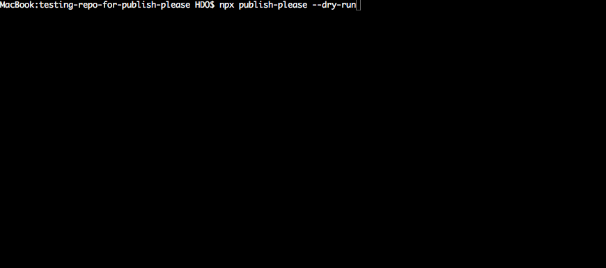
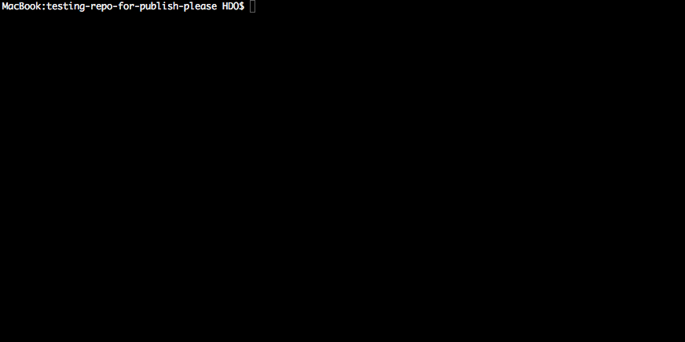

# Publish, please!
Safe and highly functional replacement for `npm publish`.

[](https://travis-ci.org/inikulin/publish-please)
[](https://www.npmjs.com/package/publish-please)
[](https://david-dm.org/inikulin/publish-please)

Publish-please enables you to :
- Validate your package before publishing to the registry
- Publish to the registry on sucessfull validation
- Run any script on successfull publishing

Publish-please is versatile enough to be used only as a validation tool before publishing or as an all-in-one tool when you want to manually handle your releases.

See how the [TestCafe](https://github.com/DevExpress/testcafe) team uses publish-please when [bumping to the next release](https://github.com/DevExpress/testcafe/commit/ab1f5ad430f307c224723a15c6425a41f25087df).

## Validate your package before publishing to the registry

There are numerous ways to "shoot yourself in the foot" using `npm publish`. 

`publish-please` enables you to check that what will be sent to the registry is valid, free of vulnerabilities and free of useless files.

Before running `npm publish`,  run this command at the root of your project folder:

```sh
npx publish-please --dry-run
```

This example shows up that you are about to push your test files to the registry:



When all validations pass, publish-please will show you the exact content of the package that will be sent to the registry, so you can check everything is included in the package:



### **The Validation Workflow performs by default the following actions:**
- **npm test**
    - Check that all tests pass

- **Checking for the vulnerable dependencies**
    - Perform vulnerable dependencies check using `npm audit`

- **Checking for the uncommitted changes**
    - Check that there are no uncommitted changes in the working tree

- **Checking for the untracked files**
    - Check that there are no untracked files in the working tree

- **Checking for the sensitive and non-essential data in the npm package**
    - Check that the npm package will not embed sensitive files or useless files (like test files)

- **Validating branch** 
    - Check that current branch is master

- **Validating git tag**
    - Check that git tag matches version specified in the `package.json`


## Customize the Validation Workflow

- **npm test**
    - you can run any kind of command in place of the `npm test` command. 
    For this you need a `.publishrc` configuration file at the root of your project. To create or modify the `.publishrc` file, run the command

    ```sh
    npx publish-please config

    Do you want to run any scripts before publishing (e.g. build steps, tests)? Yes
    Input pre-publish script: npm run my-own-script
    ```

    - if you want to disable this validation, run the command:

        ```sh
        npx publish-please config

        Do you want to run any scripts before publishing (e.g.  build steps, tests)? No
        ```
        or directly edit the property `prePublishScript` in the `.publishrc` file:

        ```json
        {
            "prePublishScript": false,
        }
         ```


- **Checking for the vulnerable dependencies**
    - This validation check uses `npm audit` under the hood. This validation check performs only if npm version is 6.1.0 or above.

    - you may prevent specific vulnerabilities to be reported by publish-please by creating a `.auditignore` file in the root of your project with content like the following:

        ```yaml
        https://npmjs.com/advisories/12
        https://npmjs.com/advisories/577
        ```
    - you may perform vulnerabilities check only for a specific vulnerability level: `critical`, `high`, `moderate` or `low`. 
    To do this create an `audit.opts` file in the root of your project with content like the following:
        ```sh
        --audit-level=high
        ```
        The above example will enable to report only vulnerabilities of level `critical` and `high`

    - if you want to disable this validation, run the command:

        ```sh
        npx publish-please config

        Would you like to verify that your package doesn`t have vulnerable dependencies before publishing? No
        ```

        or directly edit the property `vulnerableDependencies` in the `.publishrc` file:

        ```json
        {
            "validations": {
                "vulnerableDependencies": false,
            }
        }
         ```


[to be continued]